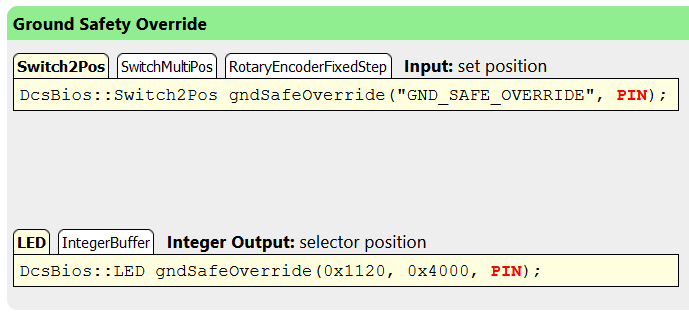

Code Snippet Reference
======================

The `Control Reference <control-reference>`_ offers different types of code snippets meant to connect different types of electromechanical components.
You can switch between different types of code snippets using the little tabs above the snippet.

Take a look at the reference for the reverse gear in the A-10C:

For the input, you have a choice between "Switch2Pos", "SwitchMultiPos" and "RotaryEncoderFixedStep" code snippets. The output for the switch position offers a "LED" and an "IntegerBuffer" code snippet.

The control reference tries to present the most relevant code snippet first. It is correct most of the time, but you should still read this section and know which code snippet to use in which situation. For example, the control reference prefers a ServoOutput code snippet for analog instruments, but you will often want the IntegerBuffer snippet instead to use custom code to drive a stepper motor or display the value on a small OLED display instead.

The rest of this section will explain when to use each type of code snippet and what circuitry goes along with it.

On logic levels and pull-up resistors
-------------------------------------

In digital logic, the voltage level on an I/O pin can either be LOW (connected to ground, at 0V) or HIGH (connected to supply voltage, which is 5V on most Arduino boards, but can also be 3.3V).

The software on the Arduino can also choose to connect each I/O pin to the supply voltage over a built-in "pull-up resistor". This ensures that the pin will always read logic HIGH when nothing is connected to it (instead of switching around randomly whenever a radio wave passes by).
The DCS-BIOS Arduino Library makes extensive use of these internal pull-up resistors to simplify the ciruits required.
Any switches are wired up so they connect the Arduino pin to ground when they are closed.
The direct ground connection to the switch is "stronger" than the connection to the supply voltage through the pull-up resistor, so the pin will read logic LOW when the switch is closed.

.. highlight:: C++

Momentary vs latched switches
-----------------------------

For the purposes of the Arduino code, there is no difference between a momentary switch like a push button or spring-loaded toggle switch and a "latching" switch like a normal toggle switch.
The only difference is that one is spring-loaded to return to a certain position and the other is not.
Electrically, they are the same, so they use the same code snippets.

Switch2Pos
----------

The *Switch2Pos* snippet is one of the simplest and most common snippets you will use. It is used for switches that have exactly two positions: push buttons and two-position toggle switches (on-off switches).

Connect one contact of your switch to ground and the other one to the Arduino pin you specify in the code snippet.

* With the switch open, the Arduino pin will be HIGH and the switch will be set to position 0 in DCS: World.
* When the switch is closed, the Arduino pin will be LOW and the switch will be set to position 1 in DCS: World.

If you notice that you mounted the switch upside down, you can add ", true" after the pin number like this to reverse the behavior of the Switch2Pos code snippet::

    DcsBios::LED gndSafeOverride(0x1120, 0x4000, 3, true);

The same trick works if you want to connect a normally-closed push button.

Switch3Pos
----------

The Switch3Pos snippet is used for three-position toggle switches (on-off-on switches).

An on-off-on switch has three terminals. Connect the center terminal to ground and the other two terminals to the Arduino pins named PIN_A and PIN_B in the code snippet.

* When the switch is in the DOWN or LEFT position, PIN_A will be connected to ground through the center terminal on the switch, the Arduino will read PIN_A as LOW and set the switch to position 0 in DCS: World.
* When the switch is in the CENTER position, none of the pins will be connected to the center terminal, the Arduino will read PIN_A and PIN_B as HIGH and set the switch to position 1 in DCS: World.
* When the switch in in the UP or RIGHT position, PIN_B will be connected to ground through the center terminal, the Arduino will read PIN_B as LOW and set the switch to position 2 in DCS: World.

SwitchMultiPos
--------------

The SwitchMultiPos code snippet is meant for multi-position selector switches with more than three positions.

A rotary switch has one center terminal and one terminal for each switch position. Connect the center terminal to ground and each switch position terminal to an Arduino pin.

When the Arduino sees that an I/O pin is LOW, it will send the corresponding switch position to DCS: World.
When no pin is LOW, it will assume the switch position has not changed.

RotaryEncoderFixedStep
----------------------

Rotary encoders are dials that can be turned infinitely in both directions.
They have three terminals: A, GND and B. If there are three terminals in a row, A and B will be the outer ones and GND will be the middle one. If your rotary encoder has five terminals, two of them will probably be connected to an integrated push button.

Connect A to PIN_A, GND to ground and B to PIN_B.

If your rotary encoder is reversed, exchange pins A and B.

The most common rotary encoders use 4 "steps per detent". This is what the DCS-BIOS Arduino Library uses by default.
If your rotary encoder uses 2 or 1 steps per detent, specify the number of steps per detent in angle brackets after "DcsBios::RotaryEncoder" like this::

    // two steps per detent:
    DcsBios::RotaryEncoder<2> ilsMhz("ILS_MHZ", "DEC", "INC", PIN_A, PIN_B);

If your rotary encoder is a "four steps per detent" model but you specify two steps per detent, you will need to advance it by two detents to move the cockpit dial by one detent.
Some people do this intentionally to make the encoder "less sensitive".

RotaryEncoderVariableStep
-------------------------

The RotaryEncoderVariableStep code snippet works just like the RotaryEncoderFixedStep snippet above, but instead of sending "DEC" and "INC" commands to DCS: World,
it sends "-" or "+" followed by a number. This number must be between 0 and 65535 and determines the amount that the cockpit dial moves when the rotary encoder is moved by one detent.

Most code examples set this number to 3200 by default, but you can change it to suit your needs.
For a course dial (such as found on an HSI), setting this to 182 (65536/360) will likely advance the virtual cockpit dial by one degree for each detent.

ActionButton
------------

The ActionButton code snippet is meant for a momentary push button. Connect your push button like you would with a Switch2Pos code snippet -- one terminal to ground, the other to the Arduino pin specified in the code snippet.

When the switch is pushed, the given command will be sent to DCS. When the switch is released, nothing happens.

ActionButtons are used in situations where the hardware on your panel does not directly correspond to what it is operating in the virtual cockpit.

Here are a few examples::

    // make a push button connected between D3 and ground toggle the ILS Mute
    // in the A-10C (handy to hook up to the built-in push button on a rotary
    // encoder that controls the ILS volume knob)
    DcsBios::ActionButton intIlsUnmute("INT_ILS_UNMUTE", "TOGGLE", 3);

    // Have two push buttons on pins 3 and 4 that decrease or increase
    // the radio preset in the A-10C
    DcsBios::ActionButton intIlsUnmute("UFC_PRESET_SEL", "DEC", 3);
    DcsBios::ActionButton intIlsUnmute("UFC_PRESET_SEL", "INC", 4);
    
    // Two limit switches in a refueling door lever assembly that
    // put the lever in the open or closed position when the corresponding
    // limit switch is pressed:
    DcsBios::ActionButton intIlsUnmute("FSCP_RCVR_LEVER", "0", 3); // close
    DcsBios::ActionButton intIlsUnmute("FSCP_RCVR_LEVER", "1", 4); // open

LED
---

The LED code snippet is offered for any number output that can either be 0 or 1.
It configures the Arduino pin as an output and turns it on when the value is 1 and off when the value is 0.

On Arduino boards with an ATMega328 or ATMega2560 controller, the I/O pins are powerful enough to drive an LED directly.
You will need to connect an LED in series with a matching current-limiting resistor between the Arduino pin and ground.

For a normal Arduino board with a 5V supply voltage, 220 ohm is a common resistor value that will allow about 15 mA of current to flow through your LED.
This is a safe value for the vast majority of LEDs and is well below the maximum allowed current for the Arduino pin, which is about 40 mA.

ServoOutput
-----------

The ServoOutput uses the Servo library that comes with the Arduino IDE to position a servo depending on the current value of the output from DCS: World.

A ServoOutput code snippet has three parameters: the pin number connected to the servo's control wire, the servo position (a pulse length in microseconds) to use for a value of 0 (544 by default) and the servo position to use for a value of 65535 (2400 by default).

Tweak the 544 and 2400 values to match the servo position to the correct scale. To reverse it, swap the two numbers.

To use a ServoOutput without getting a compile error, you need to add an "include" statement for the standard Servo library to your sketch. It has to be placed **before** the include statement for the DCS-BIOS Arduino Library::

    #include <Servo.h>
    #include "DcsBios.h"

StringBuffer and IntegerBuffer
------------------------------

The StringBuffer and IntegerBuffer are "generic" code snippets for text and number outputs.
They call a function every time a new value arrives. You can add code to that function to do whatever you need to with the new value.

For a StringBuffer, this usually means writing it to a display of some sort.

For an IntegerBuffer, you will likely do some calculations with the value to scale it to the correct unit of measurement, and then display it somewhere or use it to drive a stepper motor to move an indicator needle.

Sometimes it is more convenient to get rid of the callback function and check the current value yourself from code in the loop() function.
This is usually the case when you are displaying multiple values on the same display and want to have a sequence of events like this:

* clear the display buffer
* write the first value to the display
* write the second value to the display
* update...