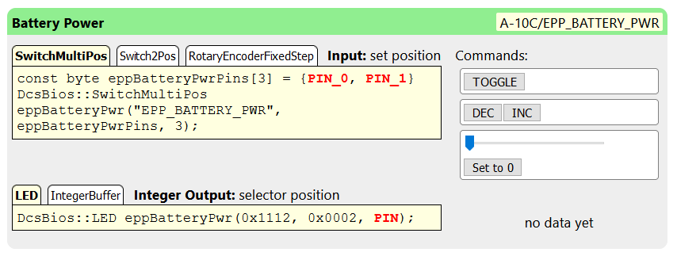
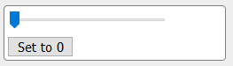
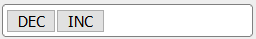
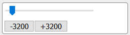
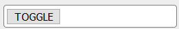

The Control Reference
=====================

A big part of DCS-BIOS are "module definitions" which tell DCS-BIOS which input and output elements exist in an aircraft, how to determine their current state, and how to operate them in the virtual cockpit using Lua scripts in DCS: World.
The Control Reference lets you look at everything that is defined in a module definition.

In other words, it shows you every dial, toggle switch, push button, indicator light and display that DCS-BIOS knows about.

On the first screen, you can select a module definition, which usually corresponds with an aircraft model.

Once you click on a module definition, you can either select a category of "controls" to browse, or search for a specific control by name or description using the search field.

.. note::
    Tip: each module definition page in the Control Reference has a unique URL, so you can create a bookmark in your browser for the reference page of your favourite aircraft.

Controls, Inputs and Outputs
-----------------------------

An "input element" or "input" is something that accepts commands, like a toggle switch or rotary knob. An "output element" or "output" is everything that produces a piece of data made available to DCS-BIOS. A "control" is a thing in the cockpit that has a name and can act as an input, output, or both.

Let's take a look at the Battery Power switch in the A-10C.

* Open the web interface, navigate to the Control Reference and select the A-10C.
* Click the "Electrical Power Panel" category and scroll down to the entry for "Battery Power". You can type a few characters into the "Filter..." text box to help you find the category link. You can also try to use the search function to jump directly to the "Battery Power" entry.

You are now looking at a "control", the battery power switch on the A-10C. It is identified by a short name ("EPP_BATTERY_POWER"). Since a different module definition could have its own EPP_BATTERY_POWER control, control identifiers can be prefixed with the module definition and a slash to make them unique. The full control identifier is shown in the top right corner.

The black text on the green bar is the description of the control, in this case "Battery Power".

Below the description and control identifier, we see that this control accepts input commands and has one integer (number) output.

The left side shows some code snippets. In the next section, you will learn how to copy and paste these into a program for an Arduino microcontroller to connect real hardware to DCS: World.

On the right side next to the input code snippets, we see buttons for each command we can send to this control. If DCS: World is running and you enter the cockpit of an A-10C, these buttons will operate the switch in your virtual cockpit.
You can use these buttons to verify that the connection to DCS is working correctly and that DCS-BIOS is operating the control in the virtual cockpit correctly.

Next to the output code examples, we see the current value that is being exported. It shows "no data yet" in the screenshot above because DCS: World is not running, so there is no virtual A-10C cockpit to connect to.
Looking at live data while DCS is running can be very useful to figure out what range of values to expect from a certain output under different flight conditions.

Output Types
------------

An output is either a number (called an "integer output") or a piece of text (called a "string output"). Most controls have either an integer output or a string output, while
some controls have no output at all. A few controls will have both an integer and a string output.

Input Interfaces
----------------

.. note:: If this part sounds confusing, don't worry about it and just continue with the next sections. It is not necessary to fully understand the concept of input interfaces to build custom hardware.

A control in DCS-BIOS can support one or more "input interfaces". An "input interface" is a set of commands that a particular control can understand.

The **set_state** input interface is the most common. It means that DCS-BIOS knows how to set a control like a toggle switch to a specific position, independently of its current position. In the control reference, it is represented with a slider and a button.  Use the slider to select the value you want, then click the button to send that value to DCS:

    
    set_state

The **fixed_step** input interface understands the "DEC" and "INC" commands, which decrease or increase the current position of a control by one. A typical example is a dial that lets you change radio presets.
The buttons to operate a fixed_step control look like this:
  

    fixed_step
  
The **variable_step** input interface is similar to fixed_step, but the "decrement" and "increment" commands have a magnitude from 0 to 65535. A typical example is a volume knob.
In the control reference. the variable_step commands are represented by a slider which represents the amount of change you want, and two buttons that let you send a decrement or increment command of the selected magnitude:

    variable_step

The **action** input interface is an arbitrary action. It is represented in the control reference by a button labelled with the name of the action. Any two-position switch supports the "TOGGLE" action. It is rarely used, but can come in handy in some special cases, for example if you want to bind the built-in push button of a physical rotary encoder to toggle the "mute" function of a volume knob.

    toggle
