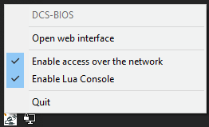
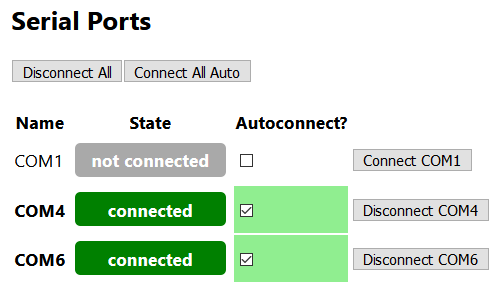

The Dashboard
=============

The Dashboard is the first screen you see when you open the web interface.

Status Indicators
-----------------

At the top, you can find various status indicators:

.. image:: images/dashboard-status-indicators.png

* **Virtual Cockpit** indicates that the DCS-BIOS Hub is exchanging cockpit data and commands with DCS: World.
* The **Lua Console** indicator shows that DCS: World is ready to accept arbitrary snippets of Lua code from the DCS-BIOS Hub.

The other two indicators show the current state of two settings that you can toggle from the system tray menu:

* When **Enable access over the network** is checked, the web interface is accessible from other computers on the network. This can be helpful if you need to use the web interface while flying and it's more convenient to use an external device rather than switching between DCS: World and a web browser on the same machine.
* When **Enable Lua Console** is checked and the Lua Console has been set up on the :doc:`DCS Connection<dcs-connection>` screen, you can use the web interface to execute arbitrary snippets of Lua code within DCS.

.. warning::
    Note that if both of these settings are enabled at the same time, anyone who can access TCP port 5010 on your computer can run arbitrary code on your machine. If you do this, make sure your computer is not directly reachable via the internet.

Managing Serial Port Connections
--------------------------------

The Dashboard screen displays a list of serial ports and allows you to configure which of these you want the DCS-BIOS Hub to connect to. If you build custom control panels, each Arduino board you connect to your PC will show up as a (virtual) COM port here. You might also see some real RS-232 ports listed, if your main board still has any.
In the following screenshot, COM1 is a real RS-232 port and is not being used, while COM4 and COM6 belong to Arduino boards that are connected via USB.

The "Autoconnect" checkbox tells the DCS-BIOS Hub that it should connect to this port when the DCS-BIOS Hub is started or when the COM port "appears", i.e. the device is plugged in and the port shows up as a new device.
If you unplug a device, its COM port will disappear from the list if autoconnect was not checked. If autoconnect was enabled, the port will be listed as "missing" instead and the connection will be reestablished as soon as it appears again.

The individual "Connect" and "Disconnect" buttons on the right can be used to temporarily connect or disconnect a port without changing the autoconnection setting.

The "Disconnect All" button disconnects from all COM ports.

The "Connect All Auto" button connects to all COM ports that have autoconnect enabled.

Managing Hub Scripts
--------------------

At the end of the Dashboard, you can manage a list of "hub scripts". Hub scripts can be used to remap commands and exported data, so you can use a simpit you built for one specific airframe with other DCS: World modules.
Learn more in the :doc:`hub-scripts` section.

* Add a hub script by clicking the "Add" button and entering the full path to the script file. You can copy the full path of a file to your clipboard by holding the Shift key while right-clicking it in Windows Explorer and then selecting "Copy as path" from the context menu.
* To remove a hub script from the list, click the "x" button next to it.
* Enable or disable a hub script with the checkbox in front of it. Disabled scripts remain in the list but are not loaded.
* Reload all hub scripts by clicking the "Reload Scripts" button above the list. Note that scripts are not automatically reloaded when you enable, disable, add or remove a list item; you have to click the "Reload Scripts" button for changes to take effect.
