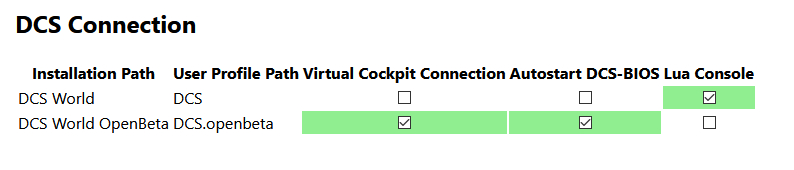

Connecting to DCS
=================

Before DCS-BIOS can communicate with DCS: World, you need to install some Lua scripts that will be picked up by DCS: World and will send data to and receive commands from DCS-BIOS.

You can do this on the "DCS Connection" screen in the web interface. It will look for the release and open beta versions of DCS: World and provide checkboxes to install the scripts:

Most users will want to check "Virtual Cockpit Connection" and "Autostart DCS-BIOS" for all DCS: World installations, and leave "Lua Console" unchecked.
In the image above, for illustration purposes the Lua Console is enabled for the release version, while the Virtual Cockpit Connection and the autostart feature are enabled for the open beta.

* The **Virtual Cockpit Connection** feature opens a communication channel between DCS: World and the DCS-BIOS Hub. It sends information about the current state of switches, indicators and displays in the virtual cockpit to the DCS-BIOS Hub and allows the DCS-BIOS Hub to trigger actions such as setting a dial to a specific position or flipping a toggle switch.
* The **Autostart DCS-BIOS** setting will automatically start the DCS-BIOS Hub in the background after you have started DCS: World.
* The **Lua Console** is an optional feature for users who write Lua scripts for DCS: World or make missions with custom triggers. You can learn more about it in the :doc:`Lua Console <lua-console>` section. Leave it disabled if you do not need it.

In the next section, we will take a closer look at the :doc:`Dashboard <dashboard>` screen.
