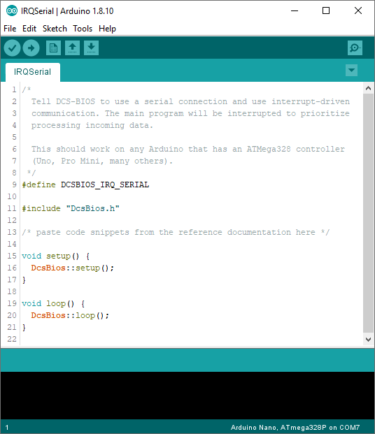
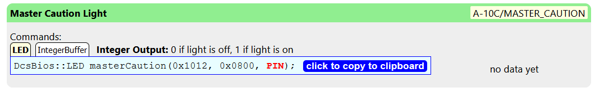
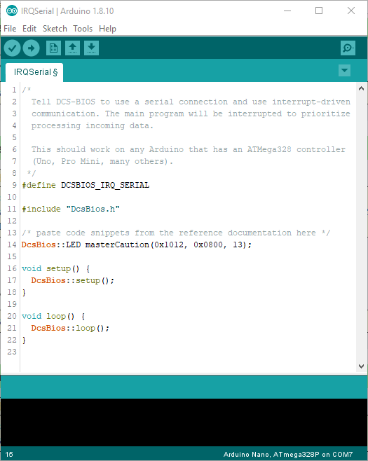

Building Hardware Panels
========================

With DCS-BIOS, you can build your own control panels and connect them to DCS: World. In general, the process looks like this:

* Order whatever buttons, switches, rotary encoders, displays and LEDs you need for your project. AliExpress and eBay are popular sources worldwide; of course, you can also order from one of the big electronics distributors like DigiKey, Mouser, and Newark/element 14.
* Find a way to mount all of those to a front plate. Depending on what tools and skills you have available, this can range from cardboard, a felt-tip pen and hot glue to backlit panels cut and engraved on CNC machines that are almost indistinguishable from the real thing at first sight.
* Electrically connect your components to an Arduino microcontroller board and program that microcontroller board to talk to DCS-BIOS. This is the step that will be described in this section of the manual.

Choosing an Arduino board
-------------------------

Arduino boards are small PCBs built around a microcontroller, which you can program with the Arduino IDE (Integrated Development Environment). You can learn more about the Arduino project at `<https://www.arduino.cc>`_.

There are many different Arduino boards available. DCS-BIOS supports boards that feature the ATMega328 or the ATMega2560 microcontrollers. That includes the Arduino Uno, Nano, Pro Mini and Mega 2560 boards.

We recommend the Arduino Nano. It has a small form factor but includes the USB port needed to program it, unlike its smaller sibling the Pro Mini.

The Arduino platform is "Open Hardware", which means anyone is allowed to make and sell these boards without paying a royalty fee. This has led to the availablility of very inexpensive "clones" on eBay and AliExpress.
While some of these use a different chip (CH340) for the USB communications, they all work perfectly fine for use with DCS-BIOS.

Wiring up your controls
-----------------------

To connect your electromechanical components to the Arduino board, you will use some combination of soldering jumper wires, solderless breadboards, and/or custom printed circuit boards.

Each Arduino board has a number of digital I/O pins (on the Arduino Nano, these are labelled D0 to D13) and a number of analog I/O pins (A0 to A7 on the Arduino Nano).
Digital pins can be used as a digital input (read a high or low voltage) and as a digital output (be turned on or off by the program). Analog inputs can also be used to read an analog voltage level,
which can be used to connect a potentiometer (e.g. to control a volume knob). With the exception of pins A6 and A7 on the Arduino Nano and Pro Mini, any analog pin on the controllers mentioned above
can also be used as a digital pin.

Digital pins 0 and 1 are used to communicate with the computer, so you cannot use them for your panels.
Most Arduino boards have a built-in LED connected to pin 13, so that pin should only be used as an output.

Programming your Arduino board
------------------------------

To program your Arduino board, you will need the Arduino IDE, which you can download for free `on the official Arduino website. <https://www.arduino.cc/>`_.

You will also need the DCS-BIOS Arduino library, which you can `download here <https://github.com/dcs-bios/dcs-bios-arduino-library/releases>`_. After downloading the library, open the Arduino IDE, select "Sketch" > "Include Library" > "Add .ZIP Library..." from the menu and choose the .ZIP file you downloaded.
You should now find a "DCS-BIOS" submenu under "File" > "Examples". Start your Arduino program by opening the "IRQ Serial" example from that menu.

The example program already includes the DCS-BIOS Arduino Library, which will take care of communicating with the DCS-BIOS Hub. However, you still need to tell it about what is connected to which pins on your Arduino board.

Let's connect the built-in LED on pin D13 to an indicator light in the cockpit. This manual section will use the Master Caution warning light in the A-10C as an example, but you can substitute any indicator light in your aircraft of choice.
Find your indicator light in the :doc:`control reference <control-reference>` and copy the code snippet that begins with "DcsBios::LED" to the clipboard by clicking on it.

Paste it into your Arduino program below the comment in line 13. Replace the text PIN at the end with the pin number the light is connected to, in this case 13 (we are using the built-in LED).
When using a digital pin, you just use the pin number; analog pins are designated as A0, A1, etc.

Press the checkbox in the toolbar to check your program for errors. If you get an orange bar and an error message at the bottom of the window, double-check that you copied the code snippet to the correct place,
replaced the text "PIN" with "13", and left the rest of the program intact. The compiler (the program that translates your program text to something the Arduino board can understand) can react to a single missing character with a long, incomprehensible error message.

To prepare to upload your program to the Arduino board, perform the following steps:

* Connect your Arduino board to your computer using a USB cable
* Select your board type from the "Tools" > "Board" menu.
* Select the COM port your board is connected to from the "Tools" > "Port" menu. If you cannot tell which port number belongs to your board, watch the Dashboard screen in the DCS-BIOS Hub web interface while you plug in your board.
* Make sure the DCS-BIOS Hub is not currently connected to your board's COM port. If the port shows up as "connected" in the Dashboard screen, click the disconnect button next to it.

Now you can click the "right arrow" symbol in the Arduino IDE's toolbar or select the "Sketch" > "Upload" menu item to transfer your program to the Arduino board.

After the progress messages have scrolled by and you see "Upload complete" at the bottom of the Arduino IDE window, connect the DCS-BIOS Hub to the COM port via the Dashboard screen in the web interface.
Start DCS and make your indicator light turn on or off by messing with the aircraft controls (in our A-10C example, you could press the "Signal Lights Test Button").
The LED on your Arduino board should mimic the indicator in your virtual cockpit.

The next section will explain each type of code snippet in detail and also explain the circuitry that goes along with it.
