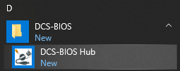
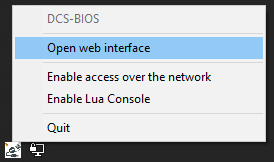

Installing DCS-BIOS
===================

Download and run the installer (called DCS-BIOS-Hub-Setup-*version*.msi) for the `latest stable release <https://github.com/dcs-bios/dcs-bios/releases/latest/>`_ from GitHub.

.. note::
    If you want a bleeding edge version or are looking for a previous release, take a look at `the complete list of releases <https://github.com/dcs-bios/dcs-bios/releases/>`_ instead.

After the installation is complete, start the DCS-BIOS Hub using the shortcut in your start menu.
The DCS-BIOS Hub is a program that exchanges cockpit data and commands between DCS: World, custom-built panels, and third-party software.

After clicking the start menu shortcut, you will find a new icon in your system tray. If you just installed DCS-BIOS, the icon will probably be hidden; you will have to click the arrow to show hidden icons. If you want Windows to always display the icon, you can drag it onto the taskbar.

Left click the icon and select the "Open web interface" menu item:

When you see a browser window showing the DCS-BIOS Hub Dashboard, continue with the next section: :doc:`dcs-connection`.

If something goes wrong, verify that your firewall is not blocking DCS-BIOS from listening on TCP port 5010.
