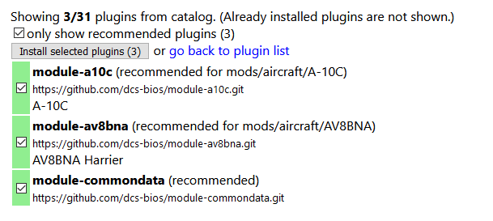
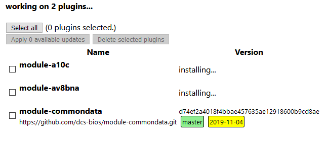

Installing DCS-BIOS
===================

Download and run the installer (called DCS-BIOS-Hub-Setup-*version*.msi) for the `latest stable release <https://github.com/dcs-bios/dcs-bios/releases/latest/>`_ from GitHub.

.. note::
    If you want a bleeding edge version or are looking for a previous release, take a look at `the complete list of releases <https://github.com/dcs-bios/dcs-bios/releases/>`_ instead.

After the installation is complete, start the DCS-BIOS Hub using the shortcut in your start menu.
The DCS-BIOS Hub is a program that exchanges cockpit data and commands between DCS: World, custom-built panels, and third-party software.

.. image:: images/startmenushortcut.png

After clicking the start menu shortcut, you will find a new icon in your system tray. If you just installed DCS-BIOS, the icon will probably be hidden; you will have to click the arrow to show hidden icons. If you want Windows to always display the icon, you can drag it onto the taskbar.

Left click the icon and select the "Open web interface" menu item:

.. image:: images/systraymenu.png

You should now be looking at a web browser showing the DCS-BIOS Hub web interface. 
If that is not the case, verify that your firewall is not blocking the DCS-BIOS Hub from listening on TCP port 5010.

Installing Plugins
------------------

The DCS-BIOS Hub only knows how to get the name of the currently active aircraft from DCS, which is not very useful.
To teach it to interact with a specific aircraft in DCS, you need to install a module definition plugin.

Click "Plugins" in the navigation menu on the left, then click "Open the plugin catalog".
You will see a list of recommended plugins for the DCS aircraft modules that DCS-BIOS has found on your hard drive:

    List of recommended plugins

Click the "Install selected plugins" button.

    
    Plugin installation in progress

Once a plugin has finished, its version will be shown. In the screenshot above, the "module-commondata" plugin has already finished installing, while the plugins for the A-10C and the Harrier are still being downloaded.

If the installation takes a while, you can just continue with the next step. The installation will continue in the background and you can monitor the progress by opening the "Plugins" page again at a later time.

Continue with the next section: :doc:`dcs-connection`.

