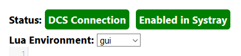

The Lua Console
===============

The Lua Console page in the web interface allows you to execute snippets of Lua code in one of three different environments within DCS ("gui", "export" and "mission").

At the top of the screen are some status indicators; both have to be green for the feature to work.

If "DCS Connection" is not active, check that you have enabled the Lua Console in the :doc:`DCS Connection<dcs-connection>` page and that DCS: World is running. If "Enabled in Systray" is inactive, enable the Lua Console through the system tray menu.

To use the Lua Console:

* select the environment you want from the dropdown below the status indicators
* enter some code in the first text field
* Press Ctrl+Enter or click the "Execute" button to send the code snippet to DCS: World and wait for the result to be displayed at the bottom

The Environments
----------------

* "gui" executes the code in the same environment that the hook that implements the Lua Console is running in.
  For more information about hooks, see "API\DCS_ControlAPI.html" in your DCS: World installation folder.
* "export" executes the code in the Export.lua environment. This is useful if you are developing a new module definition for DCS-BIOS.
* "mission" executes the code in the environment that the code snippets that are generated by the DCS: World mission editor live in. Note that this is not quite the same environment that scripts added do a mission using the "Do Script" trigger action run in.

Using the Lua Console to help with mission building
---------------------------------------------------

If you are a mission builder, this section will show you a few code snippets that can help you debug your trigger logic or custom Lua scripts.
All of these examples assume that the "Environment" drop-down menu is set to "mission".
Generally, you can check every condition and execute every trigger action that is available in the DCS: World mission editor.

.. highlight:: lua

* Check if flag 42 is set::

    return c_flag_is_true(42)

* Set flag 42 to the value 23::

    a_set_flag_value(42, 23)

* Get a list of values to use with the "X: COCKPIT PARAM..." condition::

    return list_cockpit_params()

* Get a list of indications for the "X: COCKPIT INDICATION IS EQUAL TO" condition::

    return list_indication(n)
    -- n = device ID, see mods/aircraft/.../Scripts/devices.lua

* Use a "DO SCRIPT" action to show the current value of a flag in a message::

    return  a_do_script([[
      trigger.action.outText(trigger.misc.getUserFlag(42), 5 , false)
    ]])
    -- you can also use DO SCRIPT actions to call some of your own custom Lua code.

* See a list of what is available in the "mission" environment::

    local keys = {}
    for k, v in pairs(_G) do
        keys[#keys+1] = k  
    end
    return keys